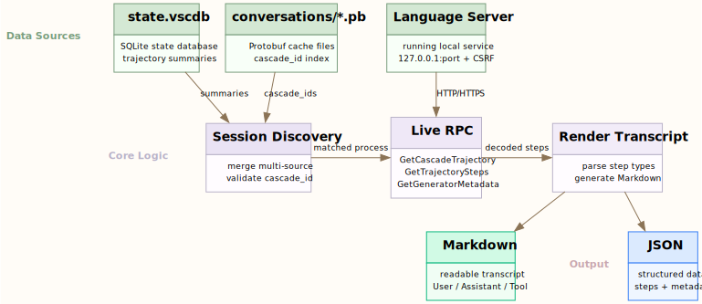

# Antigravity Trajectory Extractor

[English](README.md) | [简体中文](README.zh-CN.md)

Export Antigravity conversation trajectories through the local language server.

## What this does

This tool keeps the implementation intentionally simple:

- discovers historical `cascade_id` values from the local Antigravity conversation cache at `~/.gemini/antigravity/conversations/*.pb`
- uses the running Antigravity client to fetch live decoded trajectory data
- exports one session or all discovered sessions as Markdown or JSON

The exported live data includes:

- decoded `steps`
- a rendered Markdown `transcript`
- `generator_metadata`

## Why this project is live-first

For Antigravity, the local cache is useful for finding historical session IDs, but the most reliable way to get readable content is to ask the running local language server for the decoded trajectory.

This project therefore follows one main rule:

- cache for discovery
- live RPC for content

It does **not** try to reconstruct full transcripts offline.

## Requirements

- Antigravity desktop client running locally
- at least one relevant Antigravity `language_server` process alive
- local conversation cache present at `~/.gemini/antigravity/conversations`

Current real-world validation has been done on macOS. The code has some cross-platform path handling, but the live process discovery path is currently macOS/Linux-oriented.

## Installation

```bash
git clone <repo-url>
cd antigravity-trajectory-extractor

# Using uv (recommended)
uv sync
uv run antigravity-trajectory --help

# Or using pip
pip install -e .
antigravity-trajectory --help
```

You can also run it directly without installation:

```bash
PYTHONPATH=src python3 -m antigravity_trajectory.cli --help
```

## Usage

### List tracked workspaces

```bash
antigravity-trajectory workspaces
```

### List discovered sessions

```bash
antigravity-trajectory sessions
```

Filter by exact workspace path:

```bash
antigravity-trajectory sessions --workspace "/path/to/workspace"
```

### Extract a single session

Markdown transcript:

```bash
antigravity-trajectory extract <cascade_id>
```

JSON output:

```bash
antigravity-trajectory extract <cascade_id> --format json -o session.json
```

### Export all discovered sessions

```bash
antigravity-trajectory extract-all --format json --output-dir ./exports
```

You can also filter bulk export by workspace:

```bash
antigravity-trajectory extract-all \
  --workspace "/path/to/workspace" \
  --format markdown \
  --output-dir ./exports
```

## JSON output shape

Single-session JSON exports contain fields like:

```json
{
  "session": {
    "cascade_id": "79818ca6-9e1a-4238-bbe7-accfa8537406",
    "title": "Analyzing Book's Evolutionary Psychology"
  },
  "workspace_process": {
    "pid": 12345,
    "workspace_id": "file_...",
    "rpc_port": 63649
  },
  "trajectory": {"trajectory": {"trajectoryId": "..."}},
  "steps": [],
  "generator_metadata": [],
  "transcript": "...",
  "extraction_mode": "live_rpc"
}
```

Bulk exports also write a `manifest.json` with per-session status and output paths.

## How it works



1. Read summary metadata from Antigravity state when available.
2. Discover running Antigravity `language_server` processes.
3. Enumerate sessions from live summaries plus cache-backed `cascade_id` validation.
4. Fetch live content with:
   - `GetCascadeTrajectory`
   - `GetCascadeTrajectorySteps`
   - `GetCascadeTrajectoryGeneratorMetadata`
5. Auto-retry HTTP/HTTPS RPC schemes per port.

## Limitations

- Extraction is **live-only**. If Antigravity is not running, this tool will not reconstruct transcripts offline.
- `GetAllCascadeTrajectories` alone is not sufficient for full history, so local cache-backed discovery is still required.
- Some `generator_metadata` entries may include `messagesTruncated: true` when the server rejects `includeMessages=true` because the response is larger than the 4 MB limit.
- This is an unofficial reverse-engineered tool and may break when Antigravity changes its internal RPCs or storage layout.

## Privacy and safety notes

- The tool only talks to local `127.0.0.1` RPC endpoints exposed by Antigravity.
- It reads the local LS CSRF token from running process arguments in memory and does not intentionally print or persist it.
- Exported session files can contain sensitive conversation content. Review them before sharing.

## License

MIT

## Related Projects

- [nowledge-mem](https://mem.nowledge.co) — Personal memory system for AI agents
- [windsurf-trajectory-extractor](https://github.com/jijiamoer/windsurf-trajectory-extractor) — Offline protobuf extraction for Windsurf
