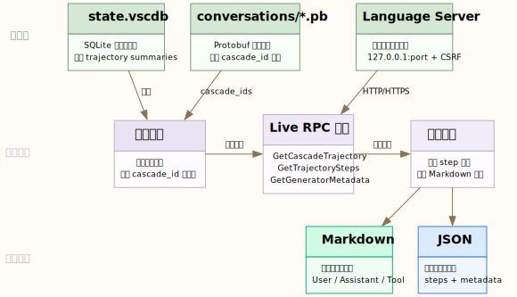

# Antigravity Trajectory Extractor

[English](README.md) | [简体中文](README.zh-CN.md)

通过本地语言服务器导出 Antigravity 对话轨迹。

## 功能概述

这个工具的实现保持简洁：

- 从本地 Antigravity 对话缓存 `~/.gemini/antigravity/conversations/*.pb` 发现历史 `cascade_id`
- 通过运行中的 Antigravity 客户端获取实时解码的轨迹数据
- 支持单个或批量导出为 Markdown 或 JSON 格式

导出的实时数据包括：

- 解码后的 `steps`（步骤）
- 渲染的 Markdown `transcript`（对话记录）
- `generator_metadata`（生成器元数据）

## 为什么采用 Live-First 架构

对于 Antigravity，本地缓存适合用于发现历史会话 ID，但获取可读内容最可靠的方式是向运行中的本地语言服务器请求解码后的轨迹。

因此本项目遵循一个核心原则：

- 缓存用于发现
- Live RPC 用于内容

本工具**不会**尝试离线重建完整对话记录。

## 系统要求

- Antigravity 桌面客户端本地运行中
- 至少一个相关的 Antigravity `language_server` 进程存活
- 本地对话缓存目录存在：`~/.gemini/antigravity/conversations`

目前已在 macOS 上完成实际验证。代码包含跨平台路径处理，但实时进程发现路径目前主要面向 macOS/Linux。

## 安装

```bash
git clone https://github.com/jijiamoer/antigravity-trajectory-extractor.git
cd antigravity-trajectory-extractor

# 使用 uv（推荐）
uv sync
uv run antigravity-trajectory --help

# 或使用 pip
pip install -e .
antigravity-trajectory --help
```

也可以直接运行而无需安装：

```bash
PYTHONPATH=src python3 -m antigravity_trajectory.cli --help
```

## 使用方法

### 列出已跟踪的工作区

```bash
antigravity-trajectory workspaces
```

### 列出已发现的会话

```bash
antigravity-trajectory sessions
```

按工作区路径过滤：

```bash
antigravity-trajectory sessions --workspace "/path/to/workspace"
```

### 提取单个会话

Markdown 格式：

```bash
antigravity-trajectory extract <cascade_id>
```

JSON 格式：

```bash
antigravity-trajectory extract <cascade_id> --format json -o session.json
```

### 批量导出所有会话

```bash
antigravity-trajectory extract-all --format json --output-dir ./exports
```

按工作区过滤批量导出：

```bash
antigravity-trajectory extract-all \
  --workspace "/path/to/workspace" \
  --format markdown \
  --output-dir ./exports
```

## JSON 输出结构

单会话 JSON 导出包含以下字段：

```json
{
  "session": {
    "cascade_id": "79818ca6-9e1a-4238-bbe7-accfa8537406",
    "title": "分析书籍的进化心理学"
  },
  "workspace_process": {
    "pid": 12345,
    "workspace_id": "file_...",
    "rpc_port": 63649
  },
  "trajectory": {"trajectory": {"trajectoryId": "..."}},
  "steps": [],
  "generator_metadata": [],
  "transcript": "...",
  "extraction_mode": "live_rpc"
}
```

批量导出还会生成 `manifest.json`，包含每个会话的状态和输出路径。

## 工作原理



1. 从 Antigravity 状态读取摘要元数据（如果可用）
2. 发现运行中的 Antigravity `language_server` 进程
3. 从实时摘要和缓存支持的 `cascade_id` 验证中枚举会话
4. 通过以下 RPC 获取实时内容：
   - `GetCascadeTrajectory`
   - `GetCascadeTrajectorySteps`
   - `GetCascadeTrajectoryGeneratorMetadata`
5. 自动重试 HTTP/HTTPS RPC 方案

## 限制

- 提取**仅限实时模式**。如果 Antigravity 未运行，本工具无法离线重建对话记录。
- 单独使用 `GetAllCascadeTrajectories` 不足以获取完整历史，因此仍需依赖本地缓存发现。
- 当服务器因响应超过 4 MB 限制而拒绝 `includeMessages=true` 时，部分 `generator_metadata` 条目可能包含 `messagesTruncated: true`。
- 这是一个非官方的逆向工程工具，当 Antigravity 更改其内部 RPC 或存储布局时可能会失效。

## 隐私与安全说明

- 本工具仅与 Antigravity 暴露的本地 `127.0.0.1` RPC 端点通信
- 它从运行进程参数中读取本地 LS CSRF token，不会故意打印或持久化该 token
- 导出的会话文件可能包含敏感对话内容，分享前请仔细审查

## 许可证

MIT

## 相关项目

- [nowledge-mem](https://mem.nowledge.co) — AI Agent 个人记忆系统
- [windsurf-trajectory-extractor](https://github.com/jijiamoer/windsurf-trajectory-extractor) — Windsurf 离线 protobuf 提取
